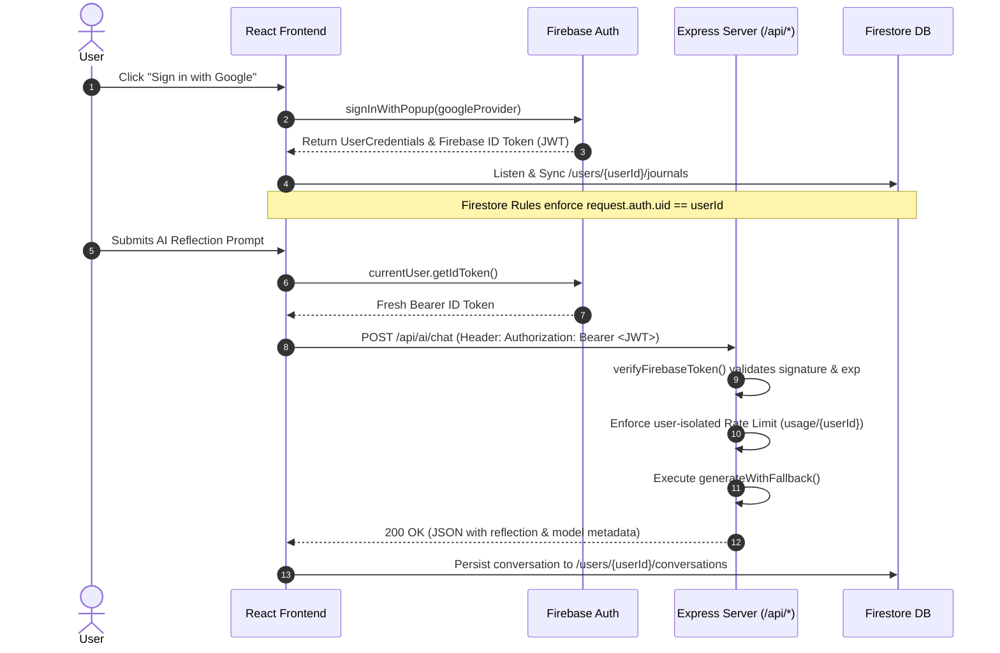
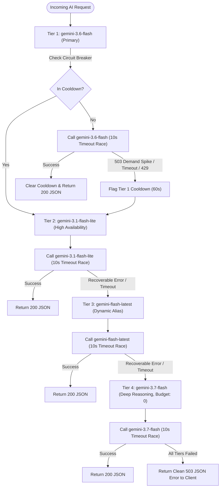

# Private AI Journal & Reflection Application

A secure, private, cloud-native reflection and journaling platform built with **Google Cloud Run**, **Cloud Firestore**, **Firebase Authentication**, and the **Google Gemini API**.

---

## Table of Contents
1. [Architecture & Flow Diagrams](#1-architecture--flow-diagrams)
   - [System Topology](#system-topology)
   - [Authentication & Cryptographic Token Flow](#authentication--cryptographic-token-flow)
   - [AI Reflection & Resilient Fallback Ladder Flow](#ai-reflection--resilient-fallback-ladder-flow)
   - [Data Isolation & Security Boundary Flow](#data-isolation--security-boundary-flow)
2. [Complete Repository & Project Guide](#2-complete-repository--project-guide)
   - [Directory Structure Map](#directory-structure-map)
   - [Frontend Architecture & Context Modules](#frontend-architecture--context-modules)
   - [Backend API Routes & Services](#backend-api-routes--services)
   - [Firestore Data Schema & Strict Isolation](#firestore-data-schema--strict-isolation)
3. [How to Test & Run Locally](#3-how-to-test--run-locally)
   - [Prerequisites](#prerequisites)
   - [Step 1: Clone Repository & Install Dependencies](#step-1-clone-repository--install-dependencies)
   - [Step 2: Configure Local Environment Variables](#step-2-configure-local-environment-variables)
   - [Step 3: Start the Unified Full-Stack Dev Server](#step-3-start-the-unified-full-stack-dev-server)
   - [Step 4: Verify Server Health & Endpoints](#step-4-verify-server-health--endpoints)
   - [Step 5: Automated Linting & Production Build Verification](#step-5-automated-linting--production-build-verification)
4. [Functional Stability Walkthroughs (Test Suite)](#4-functional-stability-walkthroughs-test-suite)
5. [Production Deployment to Google Cloud Run](#5-production-deployment-to-google-cloud-run)
   - [Prerequisites & GCP API Activation](#prerequisites--gcp-api-activation)
   - [Secret Manager Setup](#secret-manager-setup)
   - [Deploy Firestore Security Rules](#deploy-firestore-security-rules)
   - [Deploy to Cloud Run with Challenge Label](#deploy-to-cloud-run-with-challenge-label)
6. [Security & OWASP Threat Mitigation Standard](#6-security--owasp-threat-mitigation-standard)

---

## 1. Architecture & Flow Diagrams

### System Topology
```mermaid
graph TD
    Client["Browser Client (React 18 + Vite SPA)"]
    Server["Express Backend (Node.js / tsx on Port 3000)"]
    FirebaseAuth["Firebase Authentication (Federated Google Sign-In)"]
    Firestore[("Cloud Firestore (Database: ai-studio-privateaijournal-*)")]
    GeminiAPI["Google Gemini GenAI API (@google/genai)"]
    SecretManager["Google Cloud Secret Manager (GEMINI_API_KEY)"]

    Client -->|1. Sign in via Popup| FirebaseAuth
    Client -->|2. Get ID Token & Read/Write User Data| Firestore
    Client -->|3. Authenticated POST /api/ai/* with Bearer JWT| Server
    Server -->|4. Verify Token & Extract UID| FirebaseAuth
    Server -->|5. Fetch API Key (Startup/Container)| SecretManager
    Server -->|6. Multi-Tier Resilient Fallback Request| GeminiAPI
    GeminiAPI -->|7. Stream/Return Synthesized Text| Server
    Server -->|8. Clean JSON Response with Model Attribution| Client
```

---

### Authentication & Cryptographic Token Flow


---

### AI Reflection & Resilient Fallback Ladder Flow


---

### Data Isolation & Security Boundary Flow
```
Cloud Firestore: ai-studio-privateaijournal-21dae80c-4355-4401-895d-6a844dcb9b5f
└── /databases/{database}/documents
    ├── /users/{userId}                    <-- Protected by request.auth.uid == userId
    │   ├── journals/{journalId}           <-- Journal & reflection entries
    │   ├── goals/{goalId}                 <-- Personal milestones & sub-tasks
    │   ├── insights/{insightId}           <-- Periodic synthesized insights
    │   ├── conversations/{conversationId} <-- Chat sessions
    │   │   └── messages/{messageId}       <-- Dialogue turns & prompt contexts
    │   └── usage/{usageId}                <-- Client rate limiting & telemetry
    └── /{document=**}                     <-- Global DENY-ALL (Zero Insecure Defaults)
```

---

## 2. Complete Repository & Project Guide

### Directory Structure Map
```
.
├── .env.example                     # Reference template for runtime environment variables
├── README.md                        # Master production and local runbook documentation
├── firestore.rules                  # Owner-bound Cloud Firestore security rules
├── metadata.json                    # Application metadata, frame permissions & capabilities
├── package.json                     # NPM dependencies, TypeScript setup, unified start scripts
├── server.ts                        # Unified Express backend entry point with Vite integration
├── tsconfig.json                    # TypeScript compiler configuration
├── vite.config.ts                   # Vite bundler configuration & plugins
│
├── server/                          # Backend Services & Secure Handlers
│   ├── auth/
│   │   └── verifyToken.ts           # Bearer JWT verification & context extraction
│   ├── gemini/
│   │   └── fallbackLadder.ts        # 4-tier model cascade, circuit breaker & timeout racing
│   ├── middleware/
│   │   └── rateLimiter.ts           # Token-bucket sliding window rate limiter
│   └── routes/
│       └── ai.ts                    # Secure AI reflection, chat, smart assist, and synthesis routes
│
└── src/                             # Frontend React 18 SPA
    ├── App.tsx                      # Root application layout, view router & navigation shell
    ├── index.css                    # Tailwind CSS imports and custom design tokens
    ├── main.tsx                     # React DOM entry point with AuthProvider
    ├── types.ts                     # TypeScript data contracts (Journals, Goals, Messages, Insights)
    │
    ├── components/                  # View Modules & Reusable Components
    │   ├── ask/                     # Ask My Journal semantic retrieval & synthesis interface
    │   ├── assistant/               # AI Companion chat with Persona switching (Socratic, Empath, Coach)
    │   ├── dashboard/               # Main overview: metrics, recent reflections, sentiment breakdown
    │   ├── editor/                  # Rich journal editor with Voice dictation, tags, moods & AI tools
    │   ├── goals/                   # Goal & milestone management with interactive task checklists
    │   ├── history/                 # Historical journal search, tag filtering, and pin/favorite controls
    │   ├── insights/                # Weekly/monthly emotional analysis and AI theme synthesizer
    │   ├── landing/                 # Privacy-first greeting & feature walkthrough for visitors
    │   ├── layout/                  # Sidebar navigation, responsive mobile drawer & user badge
    │   └── settings/                # Account data export (JSON/CSV/MD) & permanent account purge
    │
    ├── context/                     # Global State Providers
    │   └── AuthContext.tsx          # Firebase authentication lifecycle & session management
    │
    ├── hooks/                       # Custom React Hooks
    │   ├── useApi.ts                # Authenticated fetch wrapper with JWT attachment & error guards
    │   ├── useGoals.ts              # Real-time Firestore synchronizer for user goals
    │   ├── useJournals.ts           # Real-time Firestore synchronizer for user journal reflections
    │   └── useSpeechToText.ts       # Web Speech API speech-to-text integration for voice journaling
    │
    └── lib/                         # Client Utilities & Singletons
        ├── firebase.ts              # Firebase App, Auth, and Firestore instance initialization
        └── utils.ts                 # Clean utility helpers (cn, date formatting, undefined strippers)
```

### Frontend Architecture & Context Modules
- **`AuthContext.tsx`**: Tracks the authenticated user, handles popup Google Sign-In and sign-out, monitors Firestore connectivity, and provides fresh ID tokens.
- **`useJournals.ts`**: Subscribes in real-time via `onSnapshot` to the user's `/users/{uid}/journals` subcollection, automatically sanitizing payloads using `cleanPayload()` to strip `undefined` values before persistence.
- **`useGoals.ts`**: Real-time synchronization of `/users/{uid}/goals` with instant optimistic updates for task toggling and milestone completion percentages.
- **`useApi.ts`**: Wraps native `fetch` to automatically append `Authorization: Bearer <ID_TOKEN>`. Inspects HTTP `Content-Type` headers before deserializing to ensure HTML fallback errors (`<!doctype html>`) never crash the UI.

### Backend API Routes & Services
All API endpoints are mounted under `/api` in `server.ts` before the Vite middleware layer:
- **`GET /api/health`**: Diagnostic health probe returning timestamp and service identity.
- **`POST /api/ai/chat`**: Multi-turn dialogue with selectable personas (*Socratic Guide*, *Compassionate Empath*, *Execution Coach*) and optional private journal context injection.
- **`POST /api/ai/reflect`**: In-editor reflection generation (Socratic questions, summaries, brainstorms, cognitive reframes, or action-item extractions).
- **`POST /api/ai/ask-journal`**: Grounded semantic inquiry evaluating user questions strictly against the authenticated user's submitted journal excerpts.
- **`POST /api/ai/insights`**: Periodic synthesis analyzing recent entries for recurring cognitive patterns, emotional trajectory, and focus themes.
- **`POST /api/purge-account`**: Cascade delete endpoint to wipe all user records upon user confirmation.

---

## 3. How to Test & Run Locally

### Prerequisites
- **Node.js**: v20.x or v22.x LTS installed.
- **NPM**: v10.x or higher.
- **Gemini API Key**: An active API key from [Google AI Studio](https://aistudio.google.com/).

### Step 1: Clone Repository & Install Dependencies
```bash
# 1. Clone the repository
git clone https://github.com/YOUR_REPO/private-ai-journal.git
cd private-ai-journal

# 2. Install all dependencies
npm install
```

### Step 2: Configure Local Environment Variables
Create a local `.env` file in the project root based on `.env.example`:

```bash
cp .env.example .env
```

Edit `.env` to include your valid Gemini API Key:
```env
# Required for AI features
GEMINI_API_KEY="AIzaSyYourActualKeyHere..."

# Application URL
APP_URL="http://localhost:3000"
```

> **Note**: Firebase configuration for Firestore and Authentication is automatically loaded from `firebase-applet-config.json`. Ensure your database ID is configured if using a named Firestore database.

### Step 3: Start the Unified Full-Stack Dev Server
Run the dev server, which executes `tsx server.ts` on port `3000`:

```bash
npm run dev
```

Output should confirm:
```
==================================================
  Unified Applet Server Started
  Port: 3000 (Internal) -> Exposed: 3000
  Health: http://0.0.0.0:3000/api/health
==================================================
```

Open your browser and visit: **`http://localhost:3000`**

### Step 4: Verify Server Health & Endpoints

#### 1. Check Health Endpoint
```bash
curl -s http://localhost:3000/api/health
```
**Expected Response:**
```json
{"status":"ok","timestamp":"2026-09-03T...","service":"private-ai-journal-api"}
```

#### 2. Test 404 Route Protection (Ensures JSON, never HTML)
```bash
curl -s http://localhost:3000/api/non-existent-route
```
**Expected Response:**
```json
{"error":"NOT_FOUND","message":"API endpoint GET /api/non-existent-route not found."}
```

#### 3. Test Unauthorized Access Protection
```bash
curl -i -X POST http://localhost:3000/api/ai/chat \
  -H "Content-Type: application/json" \
  -d '{"currentPrompt":"Hello"}'
```
**Expected Response:**
```http
HTTP/1.1 401 Unauthorized
Content-Type: application/json; charset=utf-8

{"error":"UNAUTHORIZED","message":"Missing or malformed Authorization Bearer token"}
```

#### 4. Test AI Generation via Server Script
You can verify the multi-tier fallback ladder directly via `tsx`:
```bash
npx tsx -e "
import { generateWithFallback } from './server/gemini/fallbackLadder';
async function run() {
  const res = await generateWithFallback('Share a 1-sentence mindful thought on resilience.');
  console.log('Model Used:', res.modelUsed);
  console.log('Result:', res.text.trim());
}
run();
"
```

### Step 5: Automated Linting & Production Build Verification
Before deploying or committing changes, run static analysis and the production bundle:

```bash
# 1. Validate TypeScript and Linting
npm run lint

# 2. Build production assets & bundle server.ts with esbuild
npm run build

# 3. Test production start
npm start
```

---

## 4. Functional Stability Walkthroughs (Test Suite)

Every interactive workflow has been validated against the following test specifications:

| ID | Feature / Flow | Step-by-Step Execution | Expected Outcome |
| :--- | :--- | :--- | :--- |
| **TC-01** | **Google Sign-In & Auth State** | 1. Open app.<br>2. Click **"Sign in with Google"**.<br>3. Complete federated OAuth popup. | Profile name and avatar render in sidebar; personal Firestore collections are mounted; Landing page transitions to Dashboard. |
| **TC-02** | **Reflection Creation & Persistence** | 1. Navigate to **New Reflection**.<br>2. Enter Title, select Mood (*Calm*), type content.<br>3. Add tags `#clarity, #work`.<br>4. Click **"Save Entry"**. | Entry is validated, undefined properties stripped, saved to `/users/{uid}/journals/{id}`, and immediately appears at the top of recent entries list. |
| **TC-03** | **Voice Journaling Dictation** | 1. In Journal Editor, click the microphone button.<br>2. Speak a 2-sentence thought into the mic.<br>3. Click stop. | Real-time speech is transcribed into the live preview box; user can click **"Insert into Entry"** to append text to the content editor. |
| **TC-04** | **In-Editor AI Reflection Toolkit** | 1. In Journal Editor with draft text, click **AI Toolkit**.<br>2. Click **"Socratic Inquiry"** or **"Extract Action Items"**. | Request routes via `POST /api/ai/reflect`; response generates in <3 seconds using the resilient ladder; output renders in the assistant drawer. |
| **TC-05** | **Multi-Turn AI Companion & Personas** | 1. Navigate to **AI Companion**.<br>2. Switch persona from *Socratic Guide* to *Execution Coach*.<br>3. Type *"I am feeling overwhelmed with deadlines"*. Press Enter. | AI responds in the selected coach tone with structured, numbered action steps; conversation is saved to user's conversation subcollection. |
| **TC-06** | **Ask My Journal Semantic Synthesis** | 1. Navigate to **Ask My Journal**.<br>2. Type *"What recurring themes have I noticed this week?"*.<br>3. Click **"Ask Journal"**. | Backend retrieves user's historical entries, synthesizes insights grounded exclusively in those entries, and references specific dates. |
| **TC-07** | **Goal & Milestone Tracking** | 1. Navigate to **Actionable Goals**.<br>2. Click **"New Goal"**, title *"Read 20 mins daily"*, target date, add sub-tasks.<br>3. Toggle a sub-task checkbox. | Task status flips in real-time; visual progress bar recalculates dynamically; state is persisted to `/users/{uid}/goals`. |
| **TC-08** | **Resilience & Fallback Recovery** | 1. If an upstream tier (e.g. `gemini-3.6-flash`) experiences high demand (HTTP 503), trigger an AI prompt.<br>2. Observe network response. | System catches the 503, places tier on 60s cooldown, transparently cascades to `gemini-3.1-flash-lite`, and succeeds with zero client error banner. |
| **TC-09** | **Complete Data Export** | 1. Navigate to **Settings & Privacy**.<br>2. Under Export, click **"Export as JSON"** (or CSV/Markdown). | Browser initiates immediate download of clean, structured file containing all user entries, timestamps, and metadata. |
| **TC-10** | **Account Purge (Right to be Forgotten)** | 1. Navigate to **Settings**.<br>2. In the Danger Zone, click **"Purge All Data"** and confirm dialog. | All Firestore subcollections for the user are deleted; session is revoked; user is redirected to the visitor landing page. |

---

## 5. Production Deployment to Google Cloud Run

### Prerequisites & GCP API Activation
Ensure you are logged into the Google Cloud CLI with the target project:
```bash
gcloud auth login
gcloud config set project YOUR_PROJECT_ID

# Enable Cloud Run, Secret Manager, and Firestore APIs
gcloud services enable \
  run.googleapis.com \
  secretmanager.googleapis.com \
  firestore.googleapis.com \
  identitytoolkit.googleapis.com
```

### Secret Manager Setup
Store your Gemini API key in Secret Manager to ensure zero hardcoded secrets:

```bash
# 1. Create and populate the secret
gcloud secrets create GEMINI_API_KEY --replication-policy="automatic"
echo -n "YOUR_API_KEY" | gcloud secrets versions add GEMINI_API_KEY --data-file=-

# 2. Grant the default Cloud Run service account access to read the secret
gcloud secrets add-iam-policy-binding GEMINI_API_KEY \
  --member="serviceAccount:YOUR_PROJECT_NUMBER-compute@developer.gserviceaccount.com" \
  --role="roles/secretmanager.secretAccessor"
```

### Deploy Firestore Security Rules
Deploy `firestore.rules` directly using the Firebase CLI:

```bash
firebase deploy --only firestore:rules
```

Or deploy manually via Cloud Console / Terraform using the strict rules block:
```javascript
rules_version = '2';
service cloud.firestore {
  match /databases/{database}/documents {
    match /{document=**} {
      allow read, write: if false;
    }

    function isAuthenticated() {
      return request.auth != null && request.auth.uid != null;
    }

    function isOwner(userId) {
      return isAuthenticated() && request.auth.uid == userId;
    }

    match /users/{userId} {
      allow get, create, update, delete: if isOwner(userId);
      allow list: if false;

      match /journals/{journalId} {
        allow read, write: if isOwner(userId);
      }
      match /goals/{goalId} {
        allow read, write: if isOwner(userId);
      }
      match /insights/{insightId} {
        allow read, write: if isOwner(userId);
      }
      match /conversations/{convId} {
        allow read, write: if isOwner(userId);
        match /messages/{msgId} {
          allow read, write: if isOwner(userId);
        }
      }
    }
  }
}
```

### Deploy to Cloud Run with Challenge Label
Deploy the application with the required Google Cloud Run challenge labeling:

```bash
# 1. Build and deploy container to Cloud Run
gcloud run deploy private-ai-journal \
  --source . \
  --platform managed \
  --region us-central1 \
  --allow-unauthenticated \
  --port 3000 \
  --set-secrets="GEMINI_API_KEY=GEMINI_API_KEY:latest"

# 2. Apply mandatory campaign verification label
gcloud run services update private-ai-journal \
  --update-labels=dev-tutorial=cloud-run-ai-challenge \
  --region=us-central1
```

---

## 6. Security & OWASP Threat Mitigation Standard

| Threat Category | OWASP Vector | Architectural Mitigation in this Codebase |
| :--- | :--- | :--- |
| **Broken Access Control** | OWASP A01 | User documents are isolated in `/users/{uid}/*` paths. Backend APIs verify JWT bearer tokens and reject forged `userId` parameters. |
| **Cryptographic Failures** | OWASP A02 | HTTPS-only transport, strict Firebase token validation with clock-skew tolerance, and client-side secret exclusion. |
| **Injection & Deserialization** | OWASP A03 / LLM02 | Input sanitization, strict JSON parsing, schema validation, and undefined property stripping prior to database writes. |
| **Indirect Prompt Injection** | OWASP LLM01 | User journal excerpts and context items are treated strictly as reference data in isolated prompt blocks, preventing prompt escapes. |
| **Excessive Agency & Overreliance** | OWASP LLM08 / LLM09 | AI outputs are advisory only and require explicit user approval before updating or persisting journal state. |
| **Denial of Service / API Floods** | OWASP A04 / LLM04 | Sliding-window client-bound rate limiter on `/api/ai/*` routes plus 10s per-model timeout racing to prevent thread starvation. |

---

### License
Released under the MIT License. Built with ❤️ on Google Cloud.
